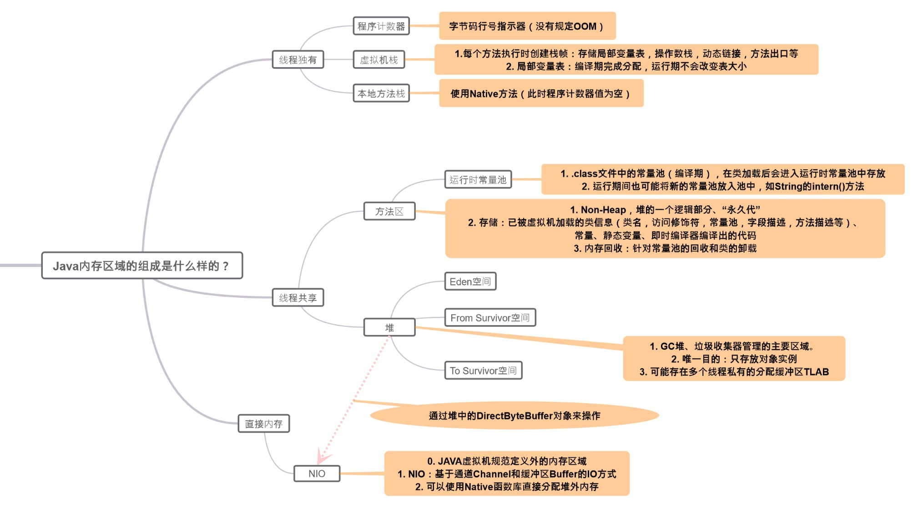
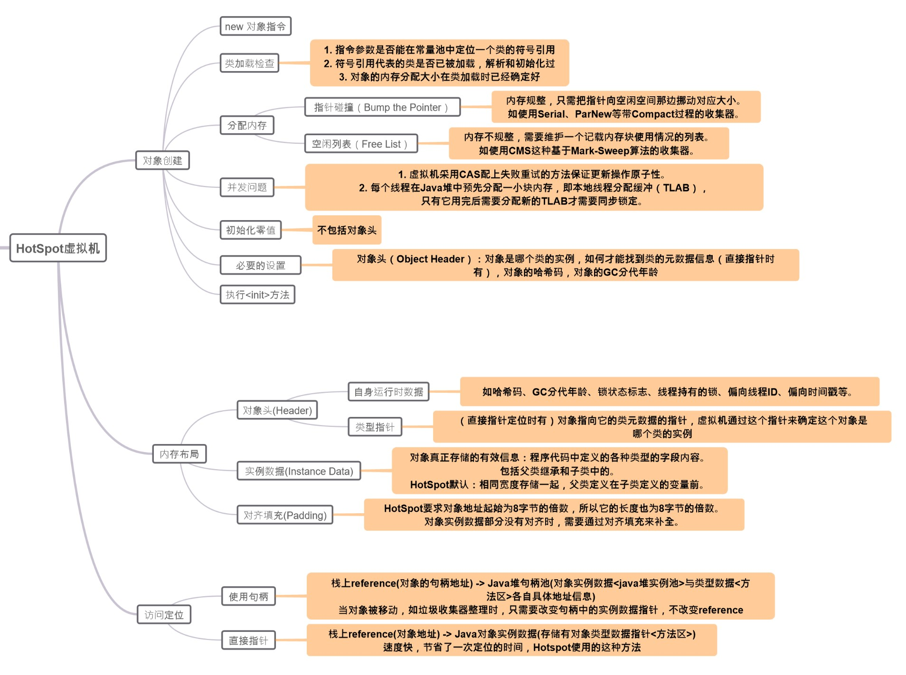
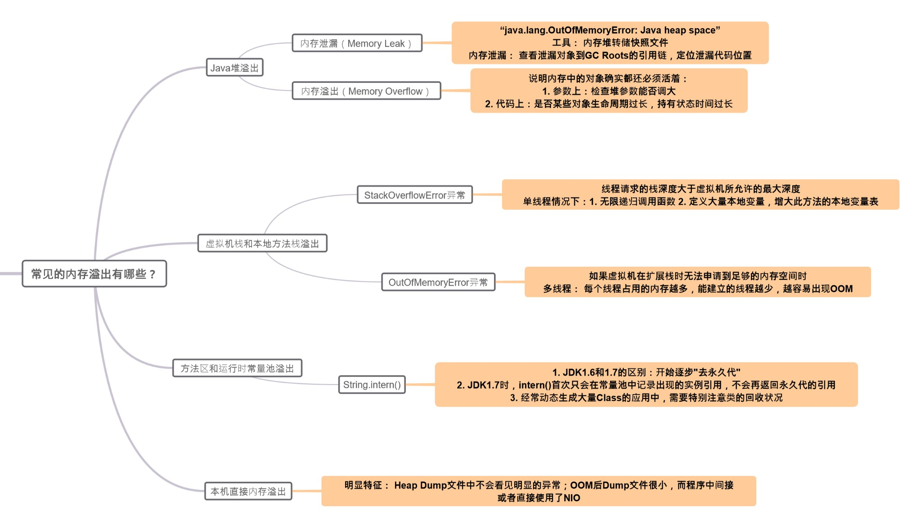

# 深入理解JAVA

## Java内存区域与内存溢出

### 内存区域的组成


### 对象相关过程


### 内存溢出

## 重点数据结构

### ArrayList
**数组队列** **非线程安全**

继承AbstractList，实现了List，RandomAccess(可随机访问), Cloneable(可被克隆)，java.io.Serializable(支持序列化，能通过序列化去传输)这几个接口。

-  默认容量：10

- 新容量 = 原容量*3/2 + 1

##  小的知识点

### try...catch...finally
```java
try{
    //抛出异常
}catch(Exception e){
    //捕获异常
}finally{
    //不管有没有异常都运行
}
```
finally在异常发生后也执行（catch没抓到），在try中的return（如果有的话）**前**执行，但不能改变返回值。