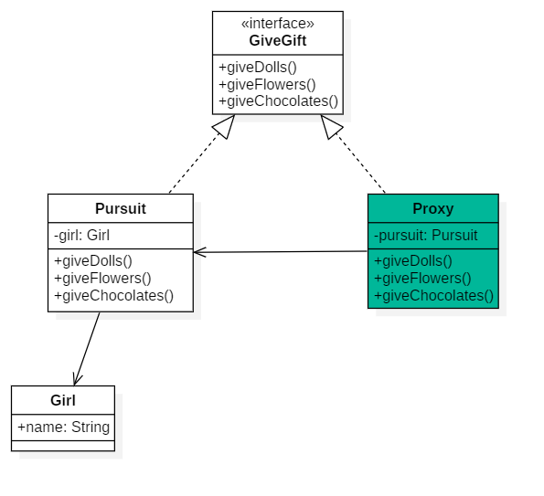
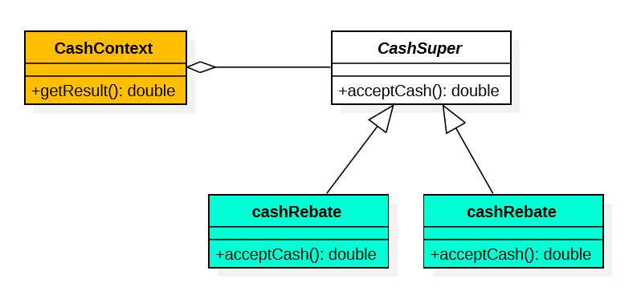

根据《大话设计模式》的内容，用java实现一些示例

# 代理模型

1. 对抽象编程：把代理类和被代理的类的共同行为抽象为接口GiveGift，所以两者有共同的方法

2. 被代理类是代理类Proxy中的一个对象成员。意思就是代理类把被代理类包起来了一样。

# 简单工厂模式

# 策略模式

定义了**算法家族**，分别封装起来，让它们之间可以**互相替换**，此模式让算法的变化，不会影响到使用算法的客户。

